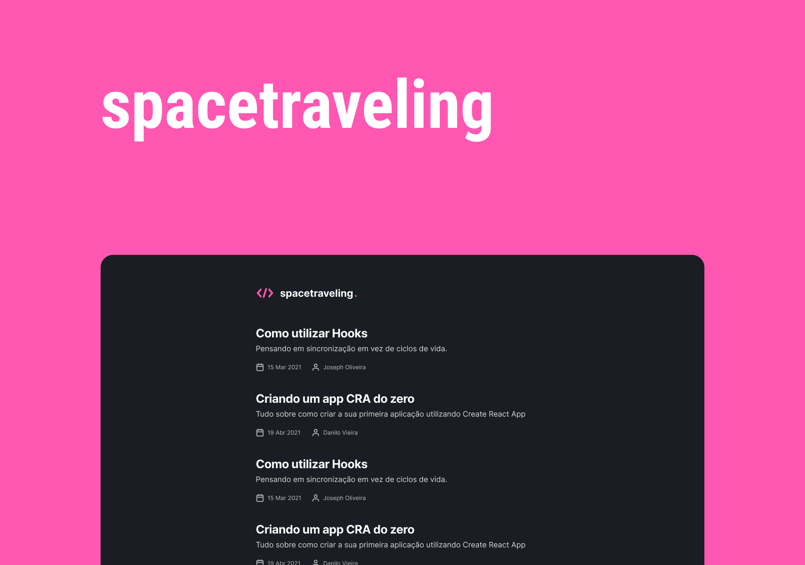

# spacetraveling

<p>
  
  
  
  <a href="https://opensource.org/licenses/MIT">
    
  </a>

</p>


## Topics

[About the spacetraveling](#about-the-spacetraveling)

[Technologies](#technologies)

[Installation and use](#installation-and-use)

[License](#license)

<br>

## About the spacetraveling

Spacetraveling was developed during a ReactJS trail challenge from the Ignite bootcamp. The challenge was to create from scratch a blog application with Prismic CMS from a Figma layout.

<br>

<p align="center">
  
</p>

## Technologies


Technologies and tools used in the project development:

- [Next.js](https://nextjs.org/)
- [TypeScript](https://www.typescriptlang.org/)
- [Sass](https://sass-lang.com/)
- [React Icons](https://react-icons.github.io/react-icons/)
- [Prismic CMS](https://prismic.io/)

<br>

## Installation and use

```bash

# Open a terminal and copy this repository with the command
git clone https://github.com/luisspassos/spacetraveling.git
# or use the download option.

# Enter the web folder with
cd spacetraveling

# Install the dependencies
yarn install

# Add your environment variables in the .env.example file
# and rename the file to .env

# Run the development server
yarn dev
```

<br>


## License
<a href="https://opensource.org/licenses/MIT">
    
</a>

<br>

This project is under the MIT license. See the [LICENSE](/LICENSE) file for more details.

---

Made with :heart: by [Luís Passos](https://github.com/luisspassos)


[](mailto:luis.passos013@gmail.com)
